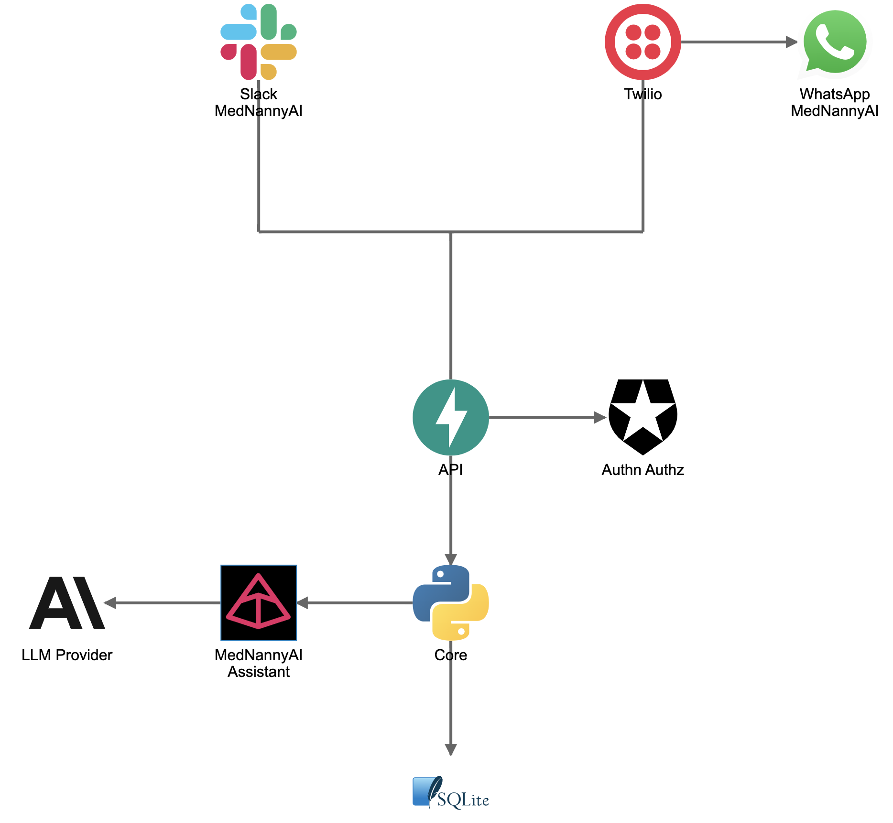

# Family Med Nanny Service Architecture

Keep this link handy: 

## System Overview
This document describes the architecture of the Family Med Nanny service, a comprehensive platform for managing family medical needs.

## High-Level Architecture

This hides a single Mermaid code block that github has issues rendering correctly. The above PNG is the correct representation of the diagram as it should render. Including a PNG of the diagram is an efficient solution. If you want to see the error, take a look.

## Service Components

### Frontend Layer
- **Slack Integration**: Real-time messaging interface on mobile/desktop/web
- **WhatsApp Integration**: Mobile messaging interface
- **Twilio Integration**: SMS messages using webhooks

### Backend Services
- **Authentication Service**: User authentication and authorization
- **User Management**: User profiles and account management
- **Medical Records**: Secure storage and management of medical information
- **AI Assistant**: Intelligent assistance for medical queries and recommendations

### Data Layer
- **Database**: sqlite for structured data storage
- **Cache**: Redis (maybe?) for session management and performance optimization

## Data Flow

## Security Architecture

## Deployment Architecture

## Technology Stack

### Frontend
- Slack API Integration
- WhatsApp Business API

### Backend
- FastAPI
- sqlite
- Pydantic AI
- Anthropic and/or OpenAI
- Redis (maybe, probably in memory caching or just go with sql db caching...it's fast enough)

### Infrastructure
- Docker
- [Railway](https://railway.com/) for deployment and monitoring
- [Twilio](https://www.twilio.com/) for **SMS Integration** uses webhooks to handle incoming/outgoing SMS messages
- Single server deployment

### Monitoring
- [Railway](https://railway.com/) should give me what I need for something of this scope out of the box.

## Next Steps

This architecture will be iteratively refined based on:
1. Specific requirements gathering
2. Performance requirements
3. Security requirements
4. Integration requirements

## Future Enhancements

- [ ] Database integration (SQLAlchemy)
- [ ] User authentication
- [ ] Medication reminders
- [ ] Drug interaction warnings
- [ ] Family member access
- [ ] Export functionality
- [ ] Photo logging
- [ ] Integration with health apps

## License

MIT License - feel free to use this for your medication management needs!
