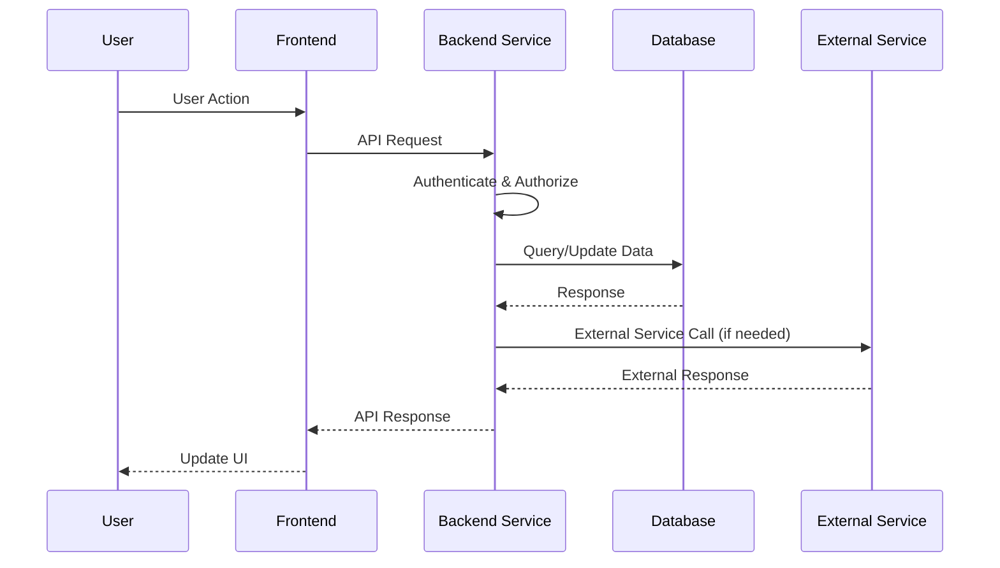
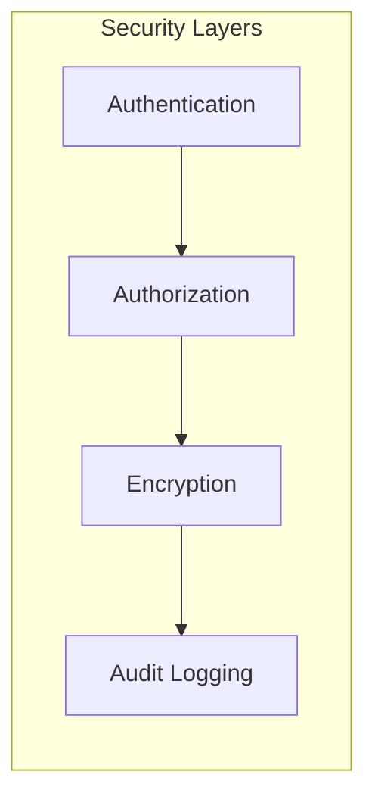
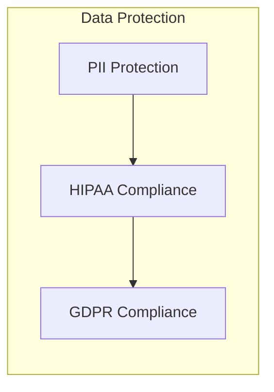
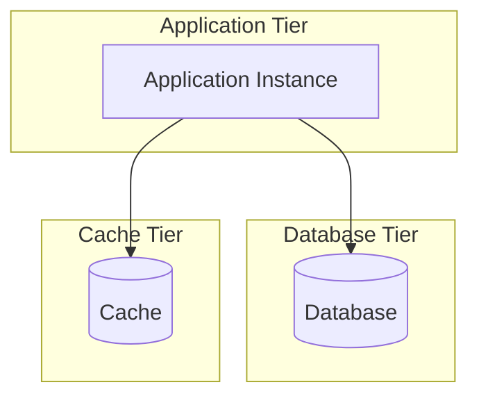

# Family Med Nanny Service Architecture

## System Overview

This document describes the architecture of the Family Med Nanny service, a comprehensive platform for managing family medical needs and nanny services.

## High-Level Architecture

## Service Components

### Frontend Layer
- **Slack Integration**: Real-time messaging interface for families and nannies
- **WhatsApp Integration**: Mobile messaging interface for families and nannies

### Backend Services
- **Authentication Service**: User authentication and authorization
- **User Management**: User profiles and account management
- **Medical Records**: Secure storage and management of medical information
- **Nanny Services**: Nanny profiles, scheduling, and service management
- **AI Assistant**: Intelligent assistance for medical queries and recommendations

### Data Layer
- **Database**: PostgreSQL for structured data storage
- **Cache**: Redis for session management and performance optimization
- **File Storage**: Secure storage for documents and medical records

## Data Flow

<!-- ---
config:
    theme: redux-dark-color
--- -->

## Security Architecture

### Security Layers

### Data Protection

## Deployment Architecture

## Technology Stack

### Frontend
- Slack API Integration
- WhatsApp Business API

### Backend
- FastAPI (Python)
- PostgreSQL
- Redis
- Celery (for background tasks)

### Infrastructure
- Docker
- Single server deployment

### Monitoring
- Prometheus
- Grafana
- ELK Stack

## Next Steps

This architecture will be iteratively refined based on:
1. Specific requirements gathering
2. Performance requirements
3. Security requirements
4. Integration requirements
