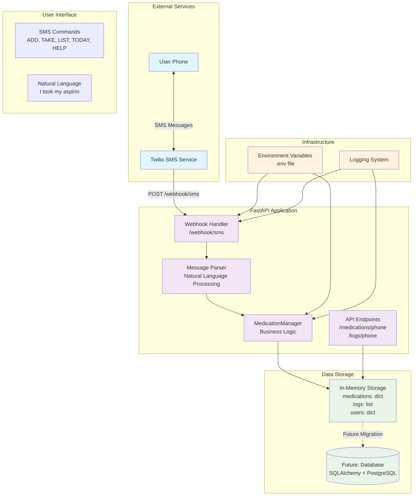
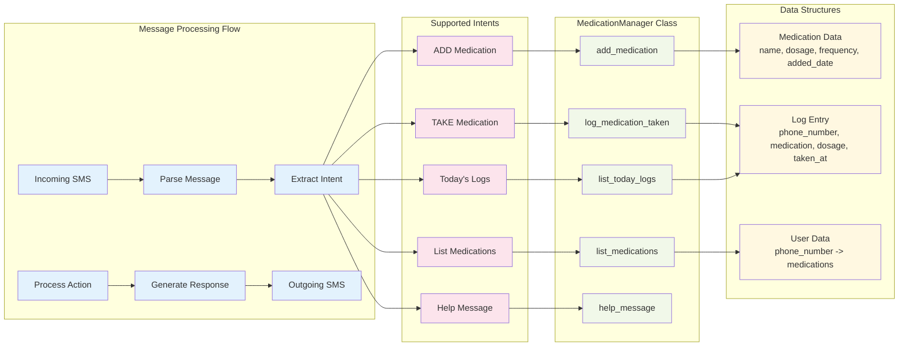
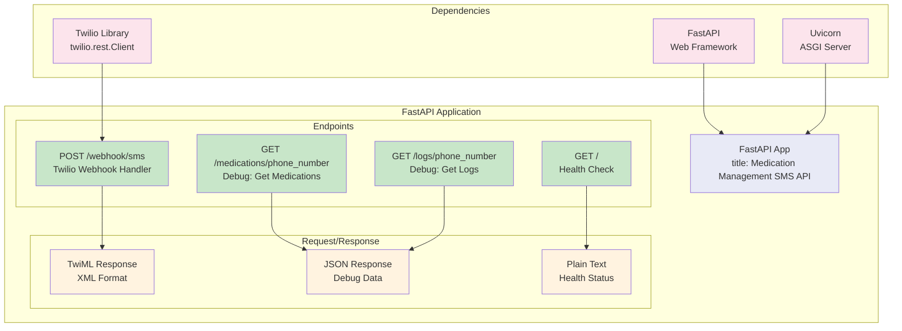
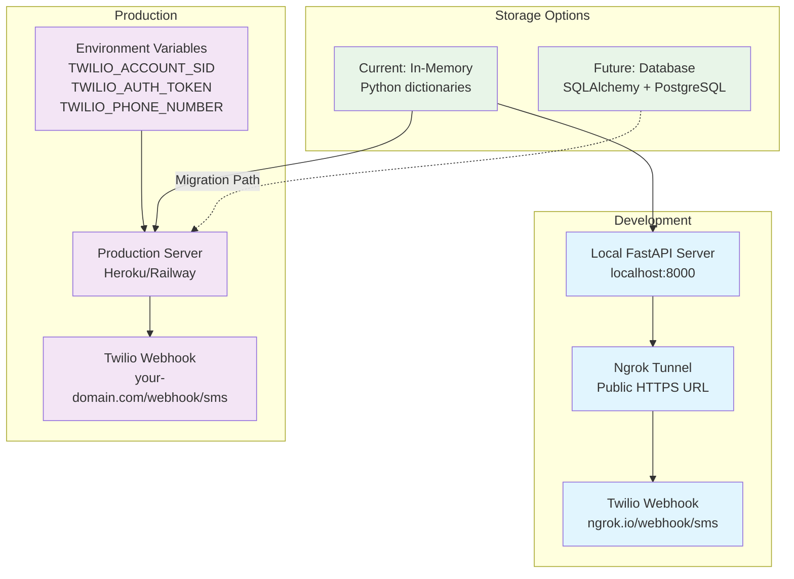

# Family Med Nanny - Architecture Diagram

## System Overview

This is a medication management SMS service built with FastAPI that allows users to manage their medications through text messages using Twilio.

## Detailed Component Architecture

## API Endpoints Architecture

## Deployment Architecture

## Key Features

- **SMS Integration**: Twilio webhook handles incoming/outgoing SMS
- **Natural Language Processing**: Understands both structured commands and natural language
- **In-Memory Storage**: Fast access to medication and log data
- **RESTful API**: Debug endpoints for data inspection
- **Async Processing**: FastAPI handles concurrent requests
- **Environment Configuration**: Secure credential management
- **Logging**: Comprehensive request and error logging

## Technology Stack

- **Backend**: FastAPI (Python)
- **SMS Service**: Twilio
- **Server**: Uvicorn (ASGI)
- **Storage**: In-memory (Python dictionaries)
- **Configuration**: python-dotenv
- **Future**: SQLAlchemy + PostgreSQL
