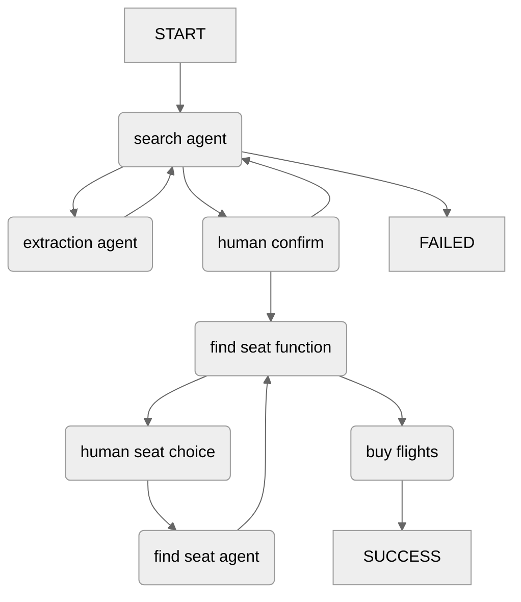

# Agent Control Flow

# Useful links to keep on hand during development

[Bolt Python API Docs](https://tools.slack.dev/bolt-python/api-docs/slack_bolt/)

[Python Slack SDK API Docs](https://tools.slack.dev/python-slack-sdk/api-docs/slack_sdk/)

[Slack API Methods](https://api.slack.com/methods)

### Middleware
[Global Middleware](https://tools.slack.dev/bolt-python/concepts/global-middleware)
- Comes in a few flavers, need to use probably
  that link is an example of middleware to look up user ids in
  a system other than slack, like mine for example.

[Webhook Response URL](https://tools.slack.dev/python-slack-sdk/webhook#the-response_url)
- this shows an example of how to capture ALL events in a single endpoint using flask

[Opening Modals](https://tools.slack.dev/python-slack-sdk/web#opening-modals)
- similar to above, but has no response really

[Args Injection](https://tools.slack.dev/bolt-python/api-docs/slack_bolt/kwargs_injection/args.html)
- Only have to pass one thing and then it is all acceseable
