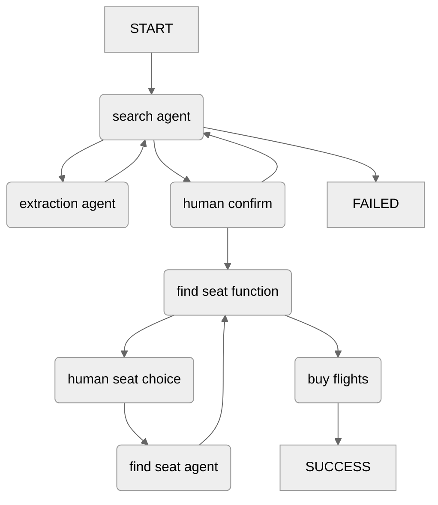

# Agent Control Flow

```mermaid
---
config:
  theme: neutral
---
flowchart TB
  START --> search_agent("search agent")
  search_agent --> extraction_agent("extraction agent")
  extraction_agent --> search_agent
  search_agent --> human_confirm("human confirm")
  human_confirm --> search_agent
  search_agent --> FAILED
  human_confirm --> find_seat_function("find seat function")
  find_seat_function --> human_seat_choice("human seat choice")
  human_seat_choice --> find_seat_agent("find seat agent")
  find_seat_agent --> find_seat_function
  find_seat_function --> buy_flights("buy flights")
  buy_flights --> SUCCESS
```
